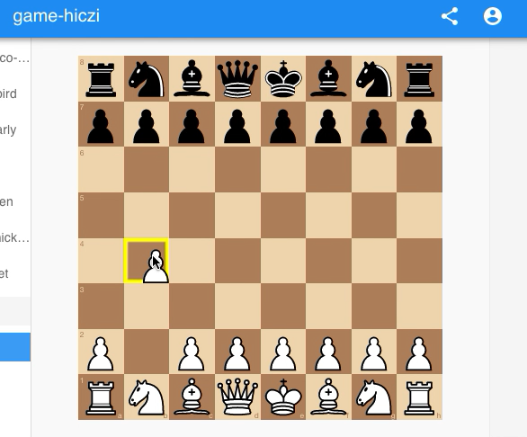
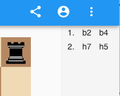

# chess-app

This is a React application for a chess game.
Core model is located at [Chess Core](../chess-core/README.md).

## Development

- `yarn` to install dependencies from root.
- `yarn start` to run app. Then open [localhost:8000](http://localhost:8000/)

---

## Publishing

1. Run the ipfs node locally:

```bash
wire ipfs start
```

2. Connect your ipfs to the swarm:

```bash
cd scripts
./ipfs_swarm_connect.sh
```

3. Publish the app:

```bash
cd examples/chess-app
yarn wire app deploy
```

4. Query to make sure it has been published:

```bash
cd scripts
./ipfs_find_app.sh wireline.io/chess
```

5. The game should be available on one of public xboxes, e.g. `xbox1.bozemanpass.net`

---

## Playing

1. Create your wallet, join the other player into a party same way is with other apps on the platform
2. When the other player connects, the game can begin
3. Play by dragging and dropping the pieces on the chess board



4. Moves history is displayed on the right hand side


